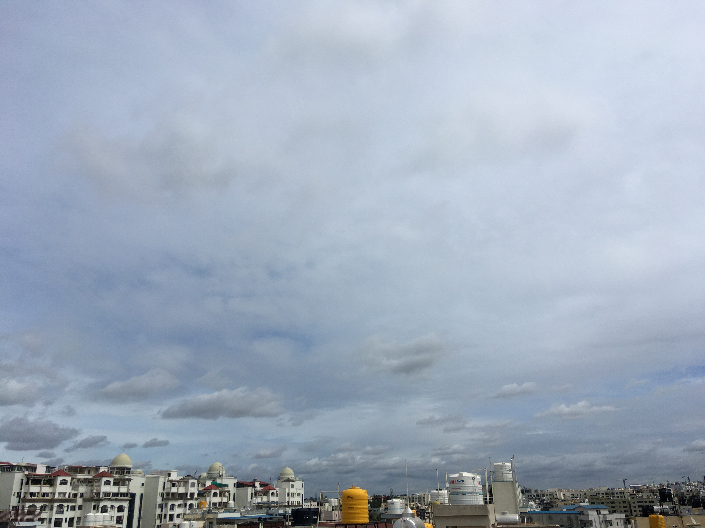

The winds sifted through my hair, whispering the unknowable. A stint of scepticism entered my mind, like silence before the storm. 

I felt too elated to heed any warning, so I brushed those thoughts aside. Free to imagination, my mind wandered to its idiosyncrasies, dreams and mirages.

The banal thoughts receded, the moment transformed slowly. A wise man said, "This too shall pass". Sure it will, but until then I drenched myself in the ephemeral. 

The uncaring world and void rested aside, thoughts of transient made themselves unaware of me. For a few moments paradoxically, I felt timeless. 

The commons hustled about their day.

The day precipitated like Hope. A serenity poisoned the air, the world on fire seemed warm than scorching. 

There were no battles to win, no way to win the battles. Surreal and absurd paved the way forward.

The world took a step back, the Sun expressed no desire. Stood still, the earth lucid in its dreamy white, nature witnessed earth bubble with false hopes.

But beyond all hope, desires, daydreams and hallucinations, time played its trick. Trickling second by second, it changed and laid devastation to whatever crossed its way.

The stoic and the nihilist in me rejected such thoughts of the romantic, but they were hardly held back by such reprimands. 

This lead to the absurdist in me to bellow and waddle, sheepishly, to the compromise, though the world might end in ice or fire, tides soared high or low, whether the poem was of life or macabre, the decision that had to be made, with no exceptions.

The decision to jostle through all, indifferent to its outcomes. With advents of day, the cobalt skies turned nickel. The hope remained embedded in time and such compromise pressed an avenue for someone like me to advance through each bit of it.
